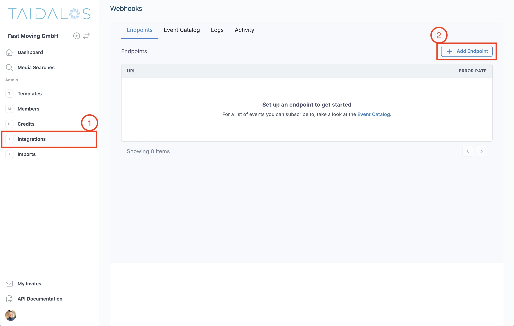
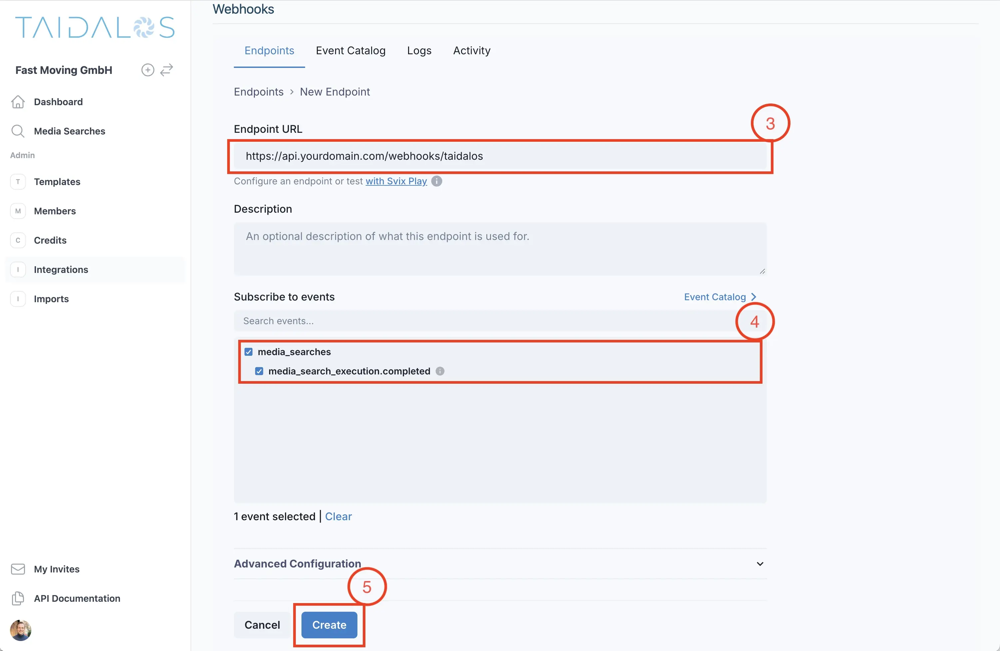
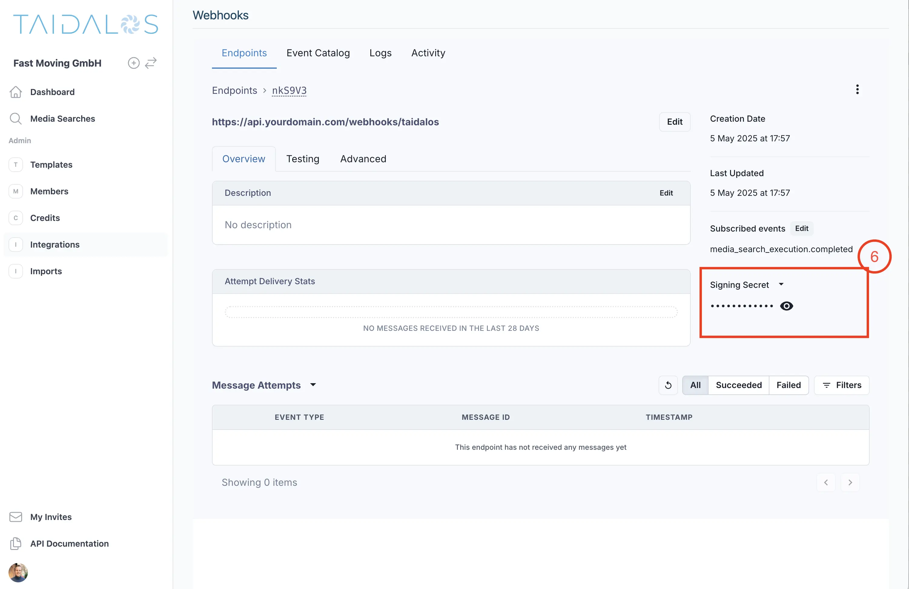
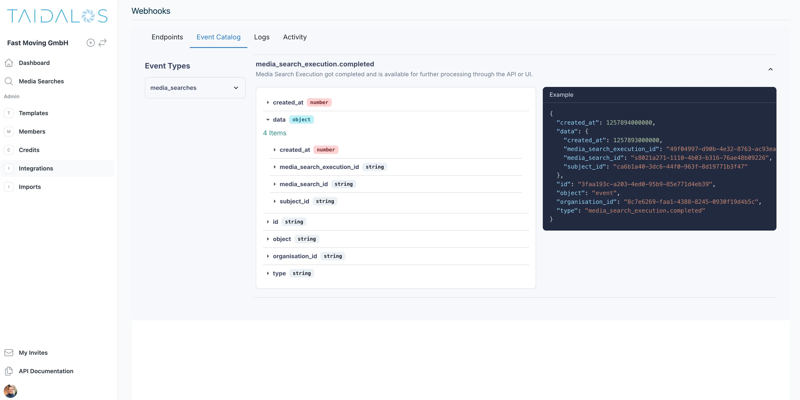

We need to process a lot of data before we can provide you with the full adverse media assessment. This can take a few
moments. We also don't like to keep you or your client waiting. That's why we have designed our system to work
asynchronously.

One way to receive the search results is by polling the API every x seconds

- https://api.taidalos.com/v1/media-searches/execution/{media_search_id}
- https://api.taidalos.com/v1/media-searches/aggregate/{media_search_execution_id}

> Warning: This works for prototyping and trying out the API. However, calling those endpoints in production can lead to
> rate limiting issues. That's why we recommend using webhooks.

We use Svix to handle the webhooks for you and us. Their focus is solely on webhook security and how to make them easy
to
use and effective
24/7 (like we do with adverse media).

# What are webhooks?

Webhooks are API calls to your server to inform you that a certain event has happened. The payload of an event contains
information to take next steps (e.g., fetch data and save to a database, send an email, etc.).

# Step-by-step

## 1. Set up a POST endpoint to receive webhooks

On your server, set up a POST endpoint to receive webhook events. An example endpoint for your application could look
like: `https://api.yourdomain.com/webhooks/taidalos`.

Make sure that there is no authentication middleware before hitting the handler. Step 3 discusses how to secure your
webhook.

## 2. Set up your webhook endpoint in Taidalos

[Sign in](https://accounts.taidalos.com/sign-in) to or [create an account](https://accounts.taidalos.com/sign-up) if you
have not already (no credit card required).

Next, go to `Integrations` and create a new webhook referencing the endpoint you have created in step 1 and subscribe to
the events you are interested in.





## 3. Process and verify incoming events

First, get the secret from the webhook settings.



Then you can verify the payload using the secret.

You can find more details for this and other events in the Event Catalog#


How you parse and process the data depends on your server language.

This is an example of how to verify the request using Python and FastAPI.

Other examples including JavaScript, Rust, Go, Java, Kotlin, Ruby, C#, PHP, cURL can be found
here: https://docs.svix.com/receiving/verifying-payloads/how

```python
from fastapi import Request, Response, status

from svix.webhooks import Webhook, WebhookVerificationError

secret = "whsec_MfKQ9r8GKYqrTwjUPD8ILPZIo2LaLaSw"

@router.post("/webhook/", status_code=status.HTTP_204_NO_CONTENT)
async def webhook_handler(request: Request, response: Response):
    headers = request.headers
    payload = await request.body()

    try:
        wh = Webhook(secret)
        msg = wh.verify(payload, headers)
    except WebhookVerificationError as e:
        response.status_code = status.HTTP_400_BAD_REQUEST
        return

    # Do something with the message...
```

## 4. Process the event

This is the event payload for the `media_search_execution.completed` event

````json
{
  "created_at": 1257894000000,
  "data": {
    "created_at": 1257893000000,
    "media_search_execution_id": "49f04997-d90b-4e32-8763-ac93ea1eb956",
    "media_search_id": "s8021a271-1110-4b03-b316-76ae48b09226",
    "subject_id": "ca6b1a40-3dc6-44f0-963f-8d19771b3f47"
  },
  "id": "3faa193c-a203-4ed0-95b9-85e771d4eb39",
  "object": "event",
  "organisation_id": "8c7e6269-faa1-4388-8245-0930f19d4b5c",
  "type": "media_search_execution.completed"
}
````

You can now be sure that the media_search_execution has been completed. This means that
calling

- GET https://api.taidalos.com/v1/media-searches/aggregate/{media_search_execution_id}
    - will return the results for the media search execution

- GET https://api.taidalos.com/v1/media-searches/execution/{media_search_id}
    - will return the results for the entire media
      search (including the execution).

You can then process the results and save them to your database.

Any questions or feedback? Please reach out to me at [julius.moeller@taidalos.com](mailto:julius.moeller@taidalos.com).